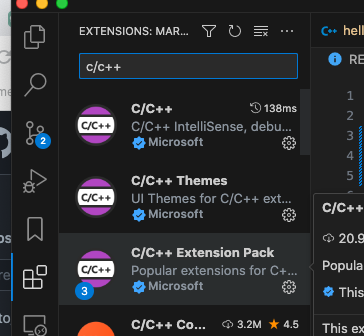
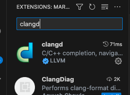

# About

vscode 搭建 C/C++ 开发环境时， C/C++ 插件提供智能提示、代码补全这些功能，非常好用，但是在大型项目中会很卡， 而且消耗很多资源



clangd 在这方面更加具有优势，功能强大，资源消耗小，是一个好的替代品。




这里提供 mac 上安装配置 clangd 插件

## 依赖库
构建本项目，需要额外下载第三方库
```bash
brew install fmt
```

## 安装使用 clangd 的方法
```json
/* 
1. 在终端安装 clangd 执行命令 brew install llvm , 这个不仅会安装 clangd 还会安装 clang和clang++

2. 安装 clangd vscode 插件

3. 禁用  C/C++ 插件的智能提示以防止冲突，在 setting.json中增加
//  "C_Cpp.intelliSenseEngine": "disabled",

4.在 setting.json 中配置 clangd 路径
// "clangd.path": "/usr/local/opt/llvm/bin/clangd"

5.在 setting.json 中配置 clangd 搜索 compile_command.json 的路径, 这个路径设置等号右边的功能原理是由 CMake-Tool 提供的， 具体查看 https://github.com/microsoft/vscode-cmake-tools/blob/main/docs/cmake-settings.md
//  "clangd.arguments": [ "--compile-commands-dir=/${command:cmake.launchTargetDirectory}" ]

// 其他 使用过程中的问题
开始发现，手写的 cmake 命令能够和 clangd 正常工作，甚至不需要再 compiledb make 扩充。

而采用 CMake-Tool 构建后，程序能正常执行，但是 clangd 报很多奇怪的错误，发现是 cmake-tool 的 kit  没有选对，默认的cmake-tool 采用系统自带的编译器，在Mac上是 /usr/bin/clang++， 然而，clangd 需要和它配套的 clang++,这个版本在安装 llvm 时和它一起被安装， 我的位于 /usr/local/Cellar/llvm/16.0.6/bin/clang++.

采用 Cmd+P CMake Edit User-Local Cmake Kits 然后加上这个 llvm 版本的高版本编译器，之后选定该Kit. 选定 Kit 的方法是 Cmd+P: Cmake Select Kit, 或者直接在 vscode 底部导航栏的快捷键（扳手图标）中选定。再次构建后，clangd 就能正常工作了

*/```